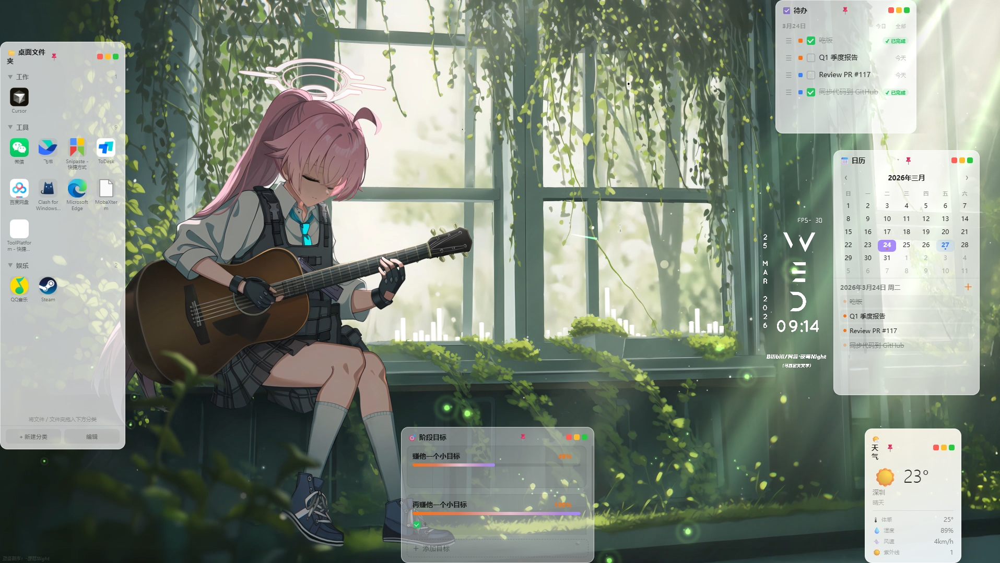
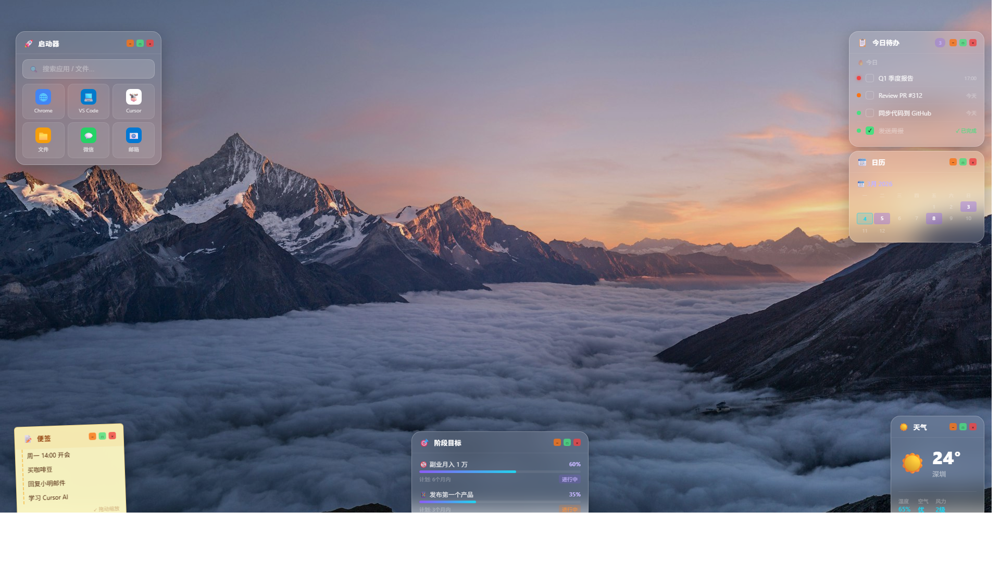

# desk-widgets 🪟

> 桌面浮层小组件 — 磨砂玻璃风格 + 全组件可拖拽的 Electron 桌面工具箱




## ✨ 功能一览

| 组件 | 说明 |
|------|------|
| 📋 **待办** | 优先级筛选、拖拽排序、与日历联动、点击日期循环截止日 |
| 📅 **日历** | 月视图、添加日程、标题栏可折叠、只读当日待办展示 |
| 🎯 **阶段目标** | 子任务自动计算进度、进度条可拖拽或精确输入 |
| 🌤 **天气** | wttr.in 实时数据、深圳、10分钟自动刷新、天气动态配色 |
| 📝 **便签** | 黄色纸张风格、600ms 防抖自动保存 |
| 📁 **桌面文件夹** | 多分类管理、拖入文件自动提取系统图标 |

## 全局能力

- ✅ 单实例锁（重复启动自动聚焦已有窗口）
- ✅ 无边框透明窗口，磨砂玻璃风格，背景透明度可调
- ✅ 边缘吸附 + 悬停恢复，置顶时自动禁用吸附
- ✅ 多屏支持（副屏坐标不回流主屏）
- ✅ 位置/透明度/置顶状态全部持久化
- ✅ 系统托盘菜单

## 快速开始

```bash
git clone https://github.com/ferralina/desk-widgets.git
cd desk-widgets
npm install
npm start
```

## 环境要求

- Node.js ≥ 18
- Electron ^41.0.3

## 项目结构

```
desk-widgets/
├── main.js              # Electron 主进程
├── preload.js           # 安全桥接层（向渲染进程暴露 window.api）
├── package.json
├── shared/
│   ├── base.css         # 全局样式（标题栏/按钮/滑块）
│   └── widget.js        # 组件共用逻辑（Pin/透明度/吸附）
└── widgets/
    ├── todo/             # 待办
    ├── calendar/         # 日历
    ├── goals/            # 阶段目标
    ├── weather/          # 天气
    ├── sticky/           # 便签
    └── launcher/         # 桌面文件夹
```

运行时数据存储在 `C:\Users\<USER>\.desk-widgets\`（`data.json`、`positions.json`、`files/`）

## 技术栈

- **Electron** ^41（无边框透明窗口 + 多进程管理）
- **SortableJS** ^1.15（拖拽排序）
- **wttr.in**（天气数据，无需 API Key）
- **纯前端**（HTML/CSS/JS，无框架依赖）

## License

MIT
